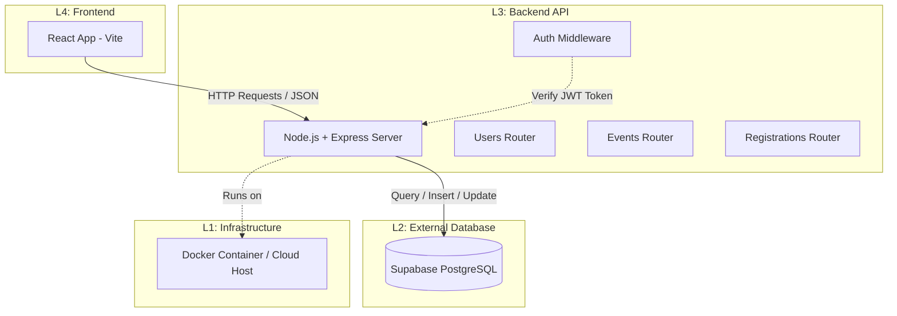
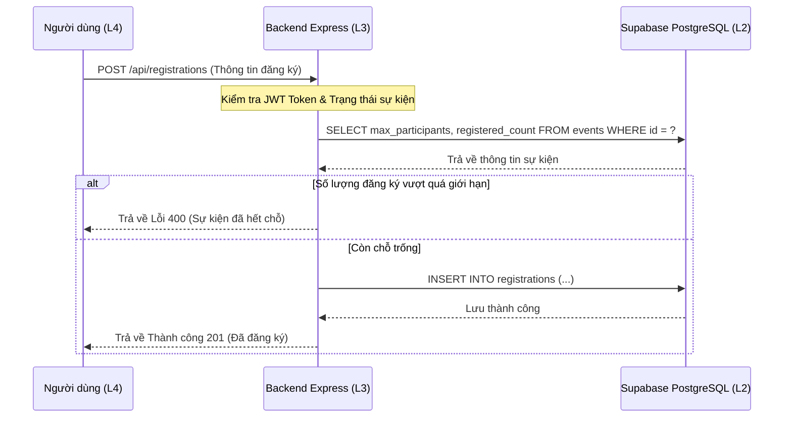

# Kiến trúc Hệ thống EventHub

Tài liệu này mô tả chi tiết kiến trúc hệ thống, các luồng dữ liệu, và phân chia các tầng (Layer) của dự án EventHub.

---

## 1. Sơ đồ Kiến trúc Tổng quan (System Overview)

Dưới đây là sơ đồ tương tác giữa các thành phần trong hệ thống:

---

## 2. Phân chia các Tầng Hệ thống (Layer Thinking)

Theo mô hình **System Thinking (Tư duy hệ thống)**, EventHub được chia thành 4 lớp rõ ràng để dễ dàng quản lý, kiểm thử, và khắc phục sự cố (debugging):

| Tầng (Layer) | Tên Tầng | Vai trò chính | Các thành phần liên quan |
| :--- | :--- | :--- | :--- |
| **L4** | **Frontend (Client)** | Hiển thị giao diện UI, xử lý tương tác người dùng, gửi yêu cầu tới API backend. | React, Vite, Fetch API, HTML5/CSS3. |
| **L3** | **Backend API** | Tiếp nhận request, xác thực quyền (JWT), xử lý logic nghiệp vụ, trả về kết quả JSON. | Express.js, Routes (Auth, Users, Events, Registrations), bcryptjs. |
| **L2** | **External (Database)** | Lưu trữ dữ liệu hệ thống lâu dài, đảm bảo tính toàn vẹn của dữ liệu và quan hệ khóa ngoại. | Supabase (PostgreSQL), bảng `users`, `events`, `registrations`. |
| **L1** | **Infrastructure** | Môi trường lưu trữ và chạy container của ứng dụng. Cấu hình cổng, mạng, file hệ thống. | Docker, Docker Compose, VPS / WSL (Ubuntu), Biến môi trường (`.env`). |

---

## 3. Quy trình Đăng ký Sự kiện (Event Registration Flow)

