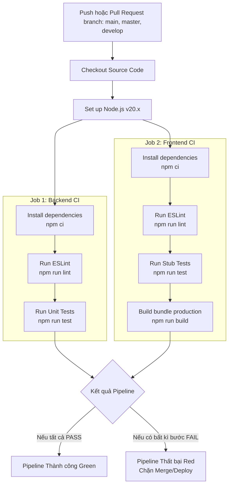

# Quy trình CI/CD EventHub

Tài liệu này mô tả chi tiết quy trình Tích hợp liên tục (Continuous Integration - CI) được thiết lập tự động qua GitHub Actions trong dự án EventHub.

---

## 1. Sơ đồ Quy trình Tích hợp liên tục (CI Flow)

Dưới đây là sơ đồ hoạt động của Pipeline khi có sự kiện đẩy code lên GitHub:

---

## 2. Các Bước Thực thi và Mô tả

Pipeline được định cấu hình tại [.github/workflows/ci.yml](file:///e:/DevOpps/doanDevopps/DoanDevOpps/.github/workflows/ci.yml) và thực thi các bước sau một cách tuần tự và độc lập cho từng service:

### 1. Trình kích hoạt (Triggers)
- Tự động chạy khi có hành động `push` hoặc tạo `pull_request` nhắm tới các nhánh:
  - `main`
  - `master`
  - `develop`

### 2. Cài đặt Môi trường
- Hệ điều hành chạy runner: `ubuntu-latest`
- Phiên bản Node.js: `20.x`
- Cơ chế cache npm: Được bật giúp tăng tốc độ cài đặt dependency giữa các lần chạy.

### 3. Backend CI Job
- **Cài đặt**: Sử dụng `npm ci` để cài đặt phiên bản dependencies chính xác tuyệt đối theo file `package-lock.json`.
- **Lint**: Chạy linter `eslint` để kiểm tra chất lượng code và bắt các lỗi biến không sử dụng, biến chưa định nghĩa.
- **Test**: Chạy unit test native của Node.js để kiểm tra logic của các endpoint và middleware.

### 4. Frontend CI Job
- **Cài đặt**: Chạy `npm ci`.
- **Lint**: Chạy linter `eslint` kiểm tra code React/Vite.
- **Test**: Chạy test stub để kiểm định xuất khẩu module API.
- **Build**: Chạy `npm run build` để tối ưu hóa, loại bỏ các file dev thừa thãi và đóng gói source code thành bộ phân phối production trong thư mục `dist`.
  - Hỗ trợ nạp các biến môi trường cấu hình Supabase qua GitHub Secrets để đảm bảo an toàn bảo mật thông tin.
